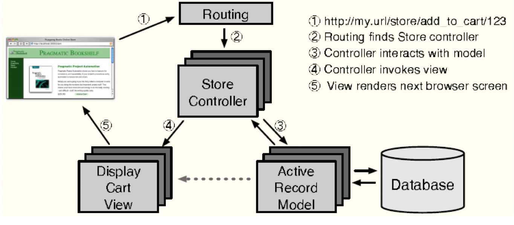
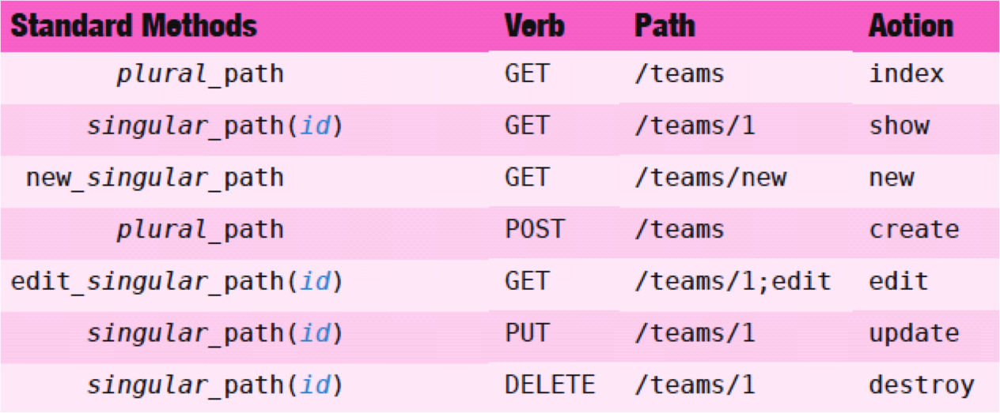

!SLIDE  bullets
# Ruby On Rails 

* Ruby Web framework
* Sinatra 
* Merb

!SLIDE bullets
# The MVC Architecture 

* Model - Datastore
* Views - web rendering
* Controller - logic

!SLIDE center
# Web request processing

!SLIDE bullets
# Deep Dive - Routing

* RESTful routes
* Why do we need them?
* http://host:port/:controller/:action/:id

!SLIDE center
# RESTful routes

!SLIDE 
# Rails directory 
## The tree
## Convention Over Configuration

!SLIDE bullets
# ORM 

* What is ORM?
* Database migrations
* Why migrations and not sqldump?
* Rake - the Ruby Make 

!SLIDE bullets
# Migration example

    @@@ruby
    def change
      create_table :users do |t|
        t.string :name
        t.string :email
        t.integer :age

        t.timestamps
      end
    end

    rake db:migrate

!SLIDE bullets
# A word on rake

* Ruby build program similar to 'make'
* Rakefile are defined in standard Ruby syntax.  (no XML)
* No quirky Makefile syntax to worry about (tab or space issues!) 
* User can add new tasks in lib/tasks/filename.rake

!SLIDE bullets
# ORM example

    @@@ruby
    class User < ActiveRecord::Base
    end

    u = User.first
    u.name    # "Gautam Rege"
    u.email   # "gautam@joshsoftware.com"
    u.height  # 5.10
    
!SLIDE bullets
# ActiveRecord - ORM

* Relationships
* Validation
* Querying
* Callbacks

!SLIDE bullets
# ActiveModel

    @@@ruby 
    class User
      include ActiveModel::Validations
      include ActiveModel::Callbacks
      include ActiveModel::Serialization
    end

!SLIDE  bullets
# ActiveRelation (Arel)
    @@@ruby
    User.where(name: 'gautam')
    User.limit(5) # joins, order

* Standarized query interface
* Chaining
* Laziness
* Scopes

!SLIDE bullets
# Rails Database Rules 
## Recommended Guidelines

* All table names should be plural:
* `id` as the auto-increment primary key
* `_id` suffix for foreign keys. 
* Datetime fields should have `_at` suffix. 
* No composite keys

!SLIDE bullets
# Rails Database Rules 
## Recommended Guidelines

* Model name should be singular.
* Model `Customer` maps to `customers` table

      Category # => ???
      Person # => ???

!SLIDE bullets
# ActiveRecord - ORM

* Relationships
* Validation
* Querying
* Callbacks

!SLIDE bullets
# ActiveRecord - Relations

* 1-M (one-to-many)
* 1-1 (one-to-one)
* M-M (many-to-many)

!SLIDE
# ActiveRecord - Relations
    @@@ruby
    class Question 
      has_many :answers
    end

    class Answer
      belongs_to :question
    end

!SLIDE
# ActiveRecord - Relations
    @@@ruby
    class Question 
      has_one :rank
    end

    class Rank
      belongs_to :question
    end

!SLIDE
# ActiveRecord - Relations
    @@@ruby
    class Question 
      has_many :category_questions
      has_many :categories, through: :category_questions
    end

    class Category
      has_many :category_questions
      has_many :questions, through: :category_questions
    end

    class CategoryQuestion
      belongs_to :category
      belongs_to :question
    end

!SLIDE
# ActiveRecord - Relations
    @@@ruby
    class Comment
      belongs_to :commentable, :polymorphic => true
    end

    class Question
      has_many :comments, :as => :accountable
    end

    class Answer
      has_many :comments, :as => :accountable
    end

!SLIDE 
# ActiveRecord - Relations
    @@@ruby
    q = Question.first
    q.comments.create

!SLIDE bullets
# ActiveRecord - Validations
    @@@ruby
    validates :name, presence: true
    validates :age, numericality: true

* validates presence
* validates numericality
* validates format
* validates association

!SLIDE bullets
# ActiveRecord - Callbacks
    @@@ruby
    before_save :authenticate_user!
    after_create :log_creation

* before [:save, :create, :update, :delete]
* after [:save, :create, :update, :delete]
* `save` and `save!` are different

!SLIDE bullets
# ActiveRecord - Querying

    @@@ruby
    Employee.first
    Employee.all.limit(5)
    Employee.all.order("age ASC")

    Employee.where(:name => "Gautam").
             where("age > ?", 20)

* Lazy query fired after scopes

!SLIDE commandline incremental
# ActiveRecord - Querying
## Join Vs Eager Loading

    $ Employee.joins(:accounts)
    SELECT `employees`.* FROM `employees` 
        INNER JOIN `accounts` ON 
        `accounts`.`employee_id` = `employees`.`id`

    $ Employee.includes(:accounts)
    SELECT `employees`.* FROM `employees` 
    SELECT `accounts`.* FROM `accounts` 
        WHERE `accounts`.`employee_id` IN (1)

!SLIDE bullets
# ActionController

* Rails HTTP request processing
* Helpers
* Filters
* Accessing the models
* Rendering the views

!SLIDE
# Processing a Rails request
    @@@ruby
    "http://host:port/:controller/:action/:id"
    "http://localhost:3000/customers/show/1"

    # The controller
    "app/controllers/customers_controller.rb"
    params[:id] = 1
    params[:action] = :show
    params[:controller] = :customers
    session

    # The view
    "app/views/customers/show.html.erb"

!SLIDE bullets
# Helpers

* Helpers are not classes but modules.
* They mainly assist views with some helper functions and global etc.
* Helper methods are accessible in controllers and views.

!SLIDE bullets
# Filters

* `before_filter`, `after_filter` are controller class methods 
* Filters can be used to check authentication, caching, or auditing before the intended action is performed. 
* Filters have access to the request, response headers

!SLIDE 
# The CustomersController

    @@@ruby
    class CustomersController < ApplicationController
      before_filter :login_required, 
                    :except => [:list, :show]

    protected
      def login_required 
        # check if user is logged in
      end 
    end 

!SLIDE bullets
# ActionView

* Embedded Ruby (erb)
* Instance variables (@variables) are copied into and ActionView instance before view invocation
* That is why all instance variables created in ActionController are available 'as is' to the views.

!SLIDE bullets
# Partials

* Partials are views which can be rendered in other views.
* They are always stored with a '_' prefix

      @@@ruby
      # _form.erb.html
      <%= render 'form' %>

!SLIDE bullets
# Layouts

*  The basic page layout for all pages.
*  Default layout: `application.erb.html`
*  Change layout using `layout <name>` in the controller.

!SLIDE bullets
#Rendering Views
##  Embedded Ruby code without rendering
    @@@ruby
    <% @categories.each do |c| %>
      Name: <%= c.name %>
    <% end %>

!SLIDE bullets
#FormHelpers

    @@@html
    <%= form_for @category do |f| %>
      
 Name: 

      <%= f.text_field :name %>

      <%= f.submit %> 
    <% end %>

!SLIDE 
# UJS and Rails
## :remote => true

    @@@ruby
    link_to "name", "/some/path", remote: true

!SLIDE bullets
# Internationalization

    @@@ruby
    # config/locales/en.yml
    en:
      hello: "Hello world"

    # config/locales/hi.yml
    hi:
      hello: "Namaste"

    # Configure the locale
    I18n.locale = "hi"

    # Views
    <%= t(:hello) %>

!SLIDE bullets
# Rails Asset Pipeline

* What is an asset?
* Why do we need the asset pipeline?
* Pre-compiling assets

!SLIDE bullets
# Coffee-script

* Ruby-like syntax
* Translates to jQuery

!SLIDE bullets
# Scss / Sass and Less

* CSS framework
* Inheritance

!SLIDE bullets
# Haml
    @@@ruby
    #content.well
      .alert= rand(100)

    

      

        <%= rand(100) %>
      

    

* Indentation with syntax
* Easier to manage

!SLIDE 
# The cool gems
    @@@ruby
    gem 'haml'
    gem 'less-rails'
    gem 'simple_form'

    group :assets do
      gem 'therubyracer'
      gem 'less-rails-bootstrap'
      gem 'sass-rails',   '~> 3.2.3'
    end

    group :test do
      gem 'rspec-rails'
    end

    gem 'paperclip' # => uploading files
    gem 'devise'    # => authentication
    gem 'cancan'    # => authorization

!SLIDE bullets
# TDD and rspec

    @@@ruby
    describe Employee do
      it "should be valid" do
        Employee.create.should be_valid
      end

      it "should have many accounts" do
        e = Employee.first
        e.accounts.create
        e.accounts.count.should eq 1
      end
    end

* Test before you code

